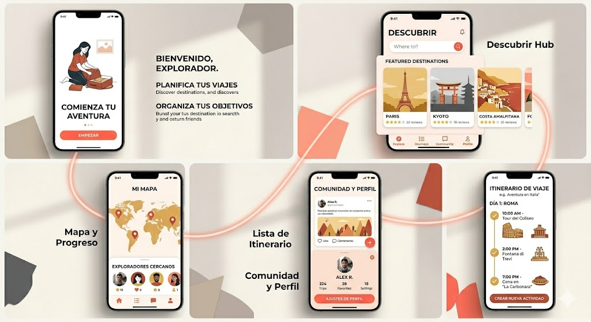

# HabitZone

**Aplicación móvil para mejorar la comunicación y la expresión verbal mediante hábitos diarios.**

## 📌 Acerca del Proyecto
HabitZone nace de la necesidad de ayudar a los estudiantes a superar sus dificultades para hablar en público, expresarse correctamente y comunicarse con seguridad en exposiciones, presentaciones o debates. 

Mediante un sistema guiado por **retos diarios** (dicción, lectura en voz alta, improvisación) y una experiencia de usuario amigable y libre de estrés (con una estética cálida estilo "viaje"), la aplicación motiva a los alumnos a generar un hábito continuo de práctica verbal.

## 🎯 Objetivos Principales
* Mejorar la pronunciación, dicción y fluidez verbal de los usuarios.
* Crear el hábito de la práctica a través de la gamificación ("Mapas de progreso").
* Reducir el miedo a hablar en público y elevar la confianza del estudiante.
* Fomentar el apoyo mutuo a través de interacciones en una comunidad de estudiantes.

## 🛠️ Stack Tecnológico
El proyecto utiliza una arquitectura separada moderna (SPA + API REST):
* **Frontend Móvil:** React.js + Vite, empaquetado nativamente para iOS y Android utilizando **Capacitor**.
* **Backend:** Node.js con framework Express.js.
* **Base de Datos:** MySQL para almacenamiento relacional seguro.

## 📂 Documentación y Planificación
La estructura y planificación inicial de la aplicación se encuentra detallada en los siguientes documentos de la raíz del proyecto:

1. 📄 **[Plan de Desarrollo / Propuesta Técnica](./plan_de_desarrollo.md)**
2. ⏱️ **[Estado Actual y Sprints del Proyecto](./estado_actual.md)**
3. 💾 **[Modelo Entidad-Relación (Base de Datos)](./modelo_entidad_relacion.md)**
4. ⚙️ **[Arquitectura de la API REST](./arquitectura_api.md)**
5. 🎨 **[Wireframes y Especificaciones UI](./wireframes_ui.md)**
6. 📘 **[Documentación Técnica (Backend/Frontend)](./documentacion_tecnica.md)**

---
* **Responsable:** Colobon Arboleda Mady Jasmin
* **Institución:** Instituto Superior Tecnológico Alberto Enríquez
* **Área / Carrera:** Desarrollo de Software
