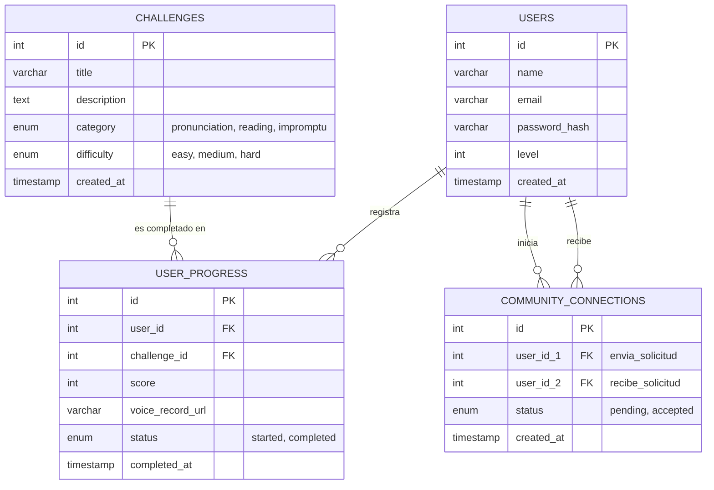

# Modelo Entidad-Relación (DER) para HabitZone

Este documento define la estructura de la base de datos relacional (MySQL) necesaria para dar soporte a las funcionalidades planteadas para HabitZone (usuarios, retos de comunicación, registro de progresos y comunidad).

## Diagrama Entidad-Relación

## Diccionario de Datos

### Tabla: `USERS` (Usuarios)
Almacena la información de los estudiantes (exploradores) registrados en la app.
* **`id` (INT, PK, AUTO_INCREMENT):** Identificador único del usuario.
* **`name` (VARCHAR):** Nombre o nickname público que se mostrará en el perfil y en la sección comunidad.
* **`email` (VARCHAR, UNIQUE):** Correo electrónico para acceso (Login).
* **`password_hash` (VARCHAR):** Contraseña encriptada (usando algoritmos como `bcrypt` desde Node.js).
* **`level` (INT):** Nivel actual del estudiante dentro de la gamificación (inicia por defecto en 1).
* **`created_at` (TIMESTAMP):** Fecha de registro en la aplicación.

### Tabla: `CHALLENGES` (Retos)
Define los ejercicios de expresión verbal que estarán disponibles en el "Descubrir Hub".
* **`id` (INT, PK, AUTO_INCREMENT):** Identificador único del reto.
* **`title` (VARCHAR):** Título descriptivo (ej. "Lectura Expresiva Nivel 1", "Trabalenguas del Tigre").
* **`description` (TEXT):** Instrucciones claras de lo que el estudiante debe hacer en el reto.
* **`category` (ENUM):** Categoría del reto (`pronunciation` para practicar dicción, `reading` para lectura en voz alta, `impromptu` para improvisación y debate).
* **`difficulty` (ENUM):** Nivel de dificultad (`easy`, `medium`, `hard`).
* **`created_at` (TIMESTAMP):** Fecha en que se agregó el reto al sistema por parte de un administrador.

### Tabla: `USER_PROGRESS` (Progreso / Itinerario del Usuario)
Esta es una tabla transaccional (puente) que relaciona a un estudiante con un reto específico y guarda su desempeño, lo cual alimenta de datos al "Mapa de Progreso" del frontend.
* **`id` (INT, PK, AUTO_INCREMENT):** Identificador único del intento.
* **`user_id` (INT, FK):** Referencia al usuario (`users.id`).
* **`challenge_id` (INT, FK):** Referencia al reto realizado (`challenges.id`).
* **`score` (INT):** Puntuación obtenida tras evaluar el reto.
* **`voice_record_url` (VARCHAR):** Enlace (URL) opcional a donde se guardó el audio de la grabación en la nube, en caso de que el estudiante quiera volver a escucharse (feedback).
* **`status` (ENUM):** Estado actual del reto (`started` si solo lo abrió y no lo terminó, `completed` si finalizó con éxito).
* **`completed_at` (TIMESTAMP):** Momento exacto en que el estudiante finalizó el reto.

### Tabla: `COMMUNITY_CONNECTIONS` (Comunidad / Red de Amigos)
Registra las interacciones sociales entre estudiantes para mantener el componente de comunidad.
* **`id` (INT, PK, AUTO_INCREMENT):** Identificador único de la conexión.
* **`user_id_1` (INT, FK):** ID del usuario que inicia la interacción (el que solicita amistad o sigue).
* **`user_id_2` (INT, FK):** ID del usuario que recibe la interacción.
* **`status` (ENUM):** Estado de la conexión (`pending` para pendiente, `accepted` para aceptada/activa).
* **`created_at` (TIMESTAMP):** Fecha de creación del vínculo social.
